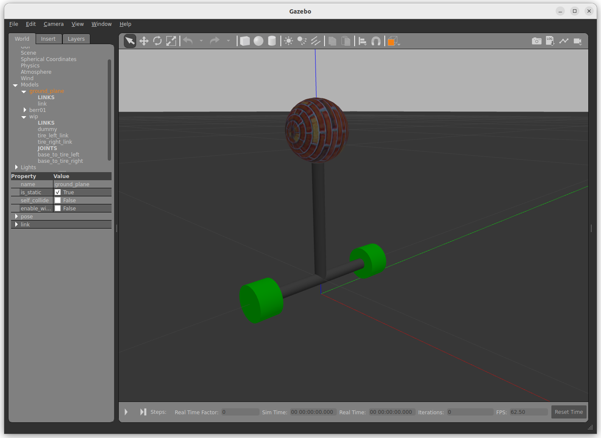

# Wheeled Invert Pendulum Project , ROS2-Gazebo11

## wip model

## gazebo simulation

### withou balance controller

wip can't stand without balance controller.
wip fall down after about 2 seconds started simulation.

### with balance controller

wip can stand with balance controller.

## launch file

pkg : bringup
file : start_process.launch.py